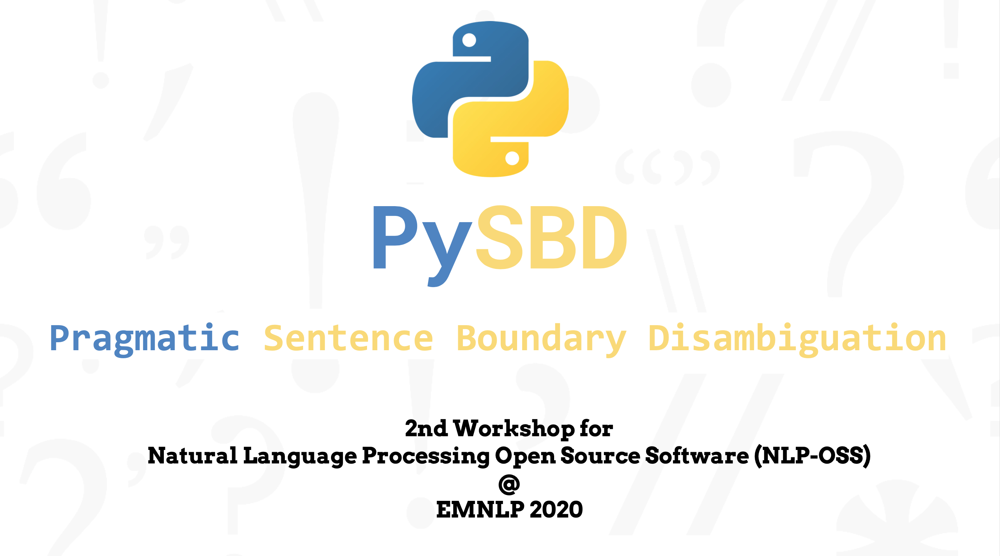
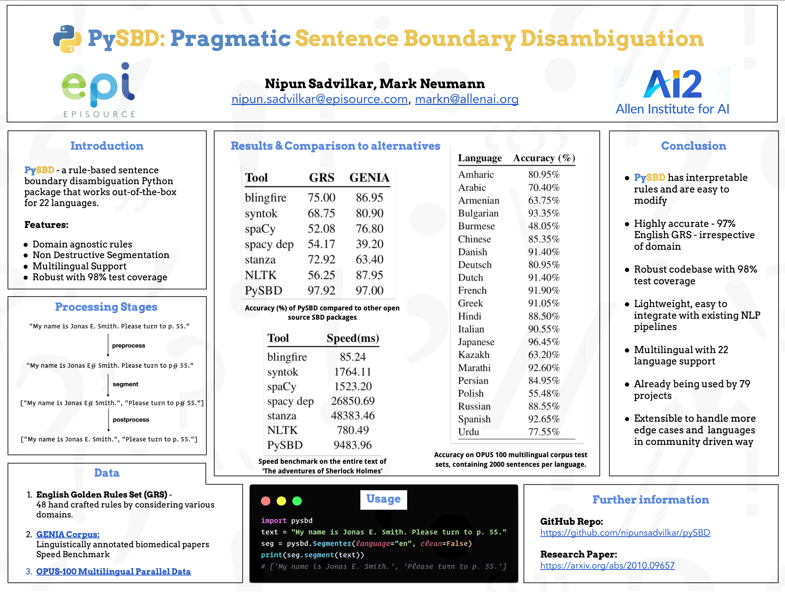

# pySBD: Python Sentence Boundary Disambiguation (SBD)

 [](https://codecov.io/gh/nipunsadvilkar/pySBD) [](https://github.com/nipunsadvilkar/pySBD/blob/master/LICENSE) [](https://pypi.python.org/pypi/pysbd) [](https://github.com/nipunsadvilkar/pySBD)

pySBD - python Sentence Boundary Disambiguation (SBD) - is a rule-based sentence boundary detection module that works out-of-the-box.

This project is a direct port of ruby gem - [Pragmatic Segmenter](https://github.com/diasks2/pragmatic_segmenter) which provides rule-based sentence boundary detection.


## Highlights
**'PySBD: Pragmatic Sentence Boundary Disambiguation'** a short research paper got accepted into 2nd Workshop for Natural Language Processing Open Source Software (NLP-OSS) at EMNLP 2020. </br>

**Research Paper:**</br>

https://arxiv.org/abs/2010.09657</br>

**[Recorded Talk:](https://slideslive.com/38939754)**</br>

[](https://slideslive.com/38939754)</br>

**Poster:**</br>

[](artifacts/pysbd_poster.png)

## Install

**Python**

    pip install pysbd

## Usage

-   Currently pySBD supports 22 languages.

```python
import pysbd
text = "My name is Jonas E. Smith. Please turn to p. 55."
seg = pysbd.Segmenter(language="en", clean=False)
print(seg.segment(text))
# ['My name is Jonas E. Smith.', 'Please turn to p. 55.']
```

-   Use `pysbd` as a [spaCy](https://spacy.io/usage/processing-pipelines) pipeline component. (recommended)</br>Please refer to example [pysbd\_as\_spacy\_component.py](https://github.com/nipunsadvilkar/pySBD/blob/master/examples/pysbd_as_spacy_component.py)
- Use pysbd through [entrypoints](https://spacy.io/usage/saving-loading#entry-points-components)

```python
import spacy
from pysbd.utils import PySBDFactory

nlp = spacy.blank('en')

# explicitly adding component to pipeline
# (recommended - makes it more readable to tell what's going on)
nlp.add_pipe(PySBDFactory(nlp))

# or you can use it implicitly with keyword
# pysbd = nlp.create_pipe('pysbd')
# nlp.add_pipe(pysbd)

doc = nlp('My name is Jonas E. Smith. Please turn to p. 55.')
print(list(doc.sents))
# [My name is Jonas E. Smith., Please turn to p. 55.]

```

## Contributing

If you want to contribute new feature/language support or found a text that is incorrectly segmented using pySBD, then please head to [CONTRIBUTING.md](https://github.com/nipunsadvilkar/pySBD/blob/master/CONTRIBUTING.md) to know more and follow these steps.

1.  Fork it ( https://github.com/nipunsadvilkar/pySBD/fork )
2.  Create your feature branch (`git checkout -b my-new-feature`)
3.  Commit your changes (`git commit -am 'Add some feature'`)
4.  Push to the branch (`git push origin my-new-feature`)
5.  Create a new Pull Request

## Citation
If you use `pysbd` package in your projects or research, please cite [PySBD: Pragmatic Sentence Boundary Disambiguation](https://www.aclweb.org/anthology/2020.nlposs-1.15).
```
@inproceedings{sadvilkar-neumann-2020-pysbd,
    title = "{P}y{SBD}: Pragmatic Sentence Boundary Disambiguation",
    author = "Sadvilkar, Nipun  and
      Neumann, Mark",
    booktitle = "Proceedings of Second Workshop for NLP Open Source Software (NLP-OSS)",
    month = nov,
    year = "2020",
    address = "Online",
    publisher = "Association for Computational Linguistics",
    url = "https://www.aclweb.org/anthology/2020.nlposs-1.15",
    pages = "110--114",
    abstract = "We present a rule-based sentence boundary disambiguation Python package that works out-of-the-box for 22 languages. We aim to provide a realistic segmenter which can provide logical sentences even when the format and domain of the input text is unknown. In our work, we adapt the Golden Rules Set (a language specific set of sentence boundary exemplars) originally implemented as a ruby gem pragmatic segmenter which we ported to Python with additional improvements and functionality. PySBD passes 97.92{\%} of the Golden Rule Set examplars for English, an improvement of 25{\%} over the next best open source Python tool.",
}
```

## Credit

This project wouldn't be possible without the great work done by [Pragmatic Segmenter](https://github.com/diasks2/pragmatic_segmenter) team.
